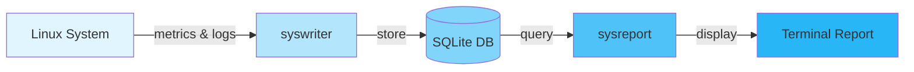
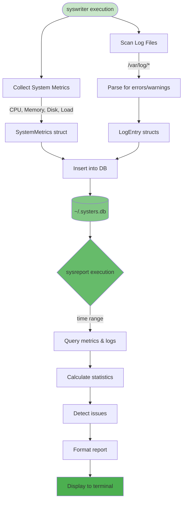
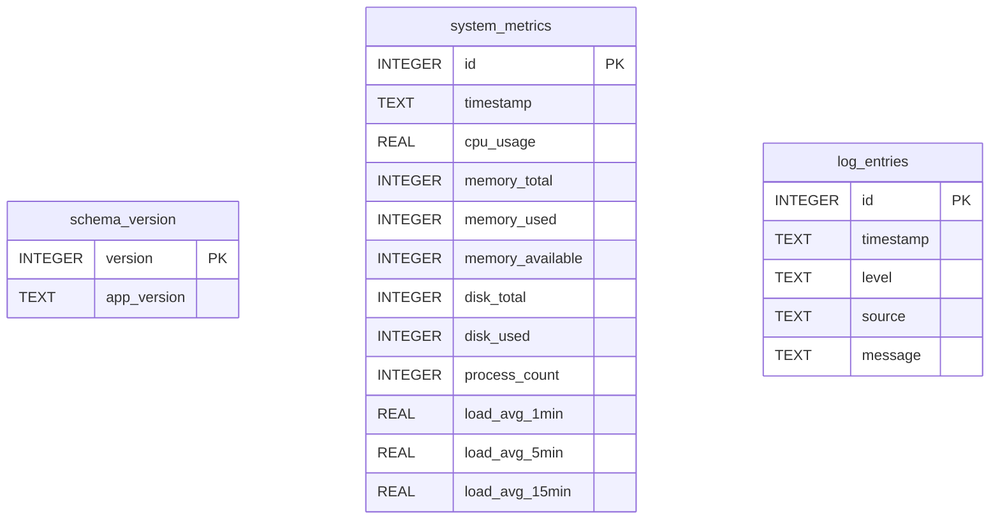

# systers

A system analysis and monitoring tool for Linux hosts that collects system metrics and log data, then generates comprehensive summary reports to help identify issues and guide maintenance tasks.

## Architecture

Systers consists of two complementary utilities that work together:

1. **syswriter** - A data collector that gathers system metrics and log information, storing them in a SQLite database
2. **sysreport** - A report generator that analyzes the collected data and produces formatted summaries



### Data Flow



## Features

- **System Metrics Collection**: CPU usage, memory usage, disk space, process counts, and load averages
- **Log Analysis**: Scans system logs for errors, warnings, and critical issues
- **Issue Detection**: Automatically identifies potential problems (high resource usage, critical errors)
- **Historical Analysis**: View trends and patterns over time
- **Actionable Recommendations**: Provides guidance on maintenance tasks

## Installation

### Prerequisites

- Rust 1.70 or later
- Linux operating system (tested on Ubuntu/Debian)

### Build from source

```bash
# Clone the repository
git clone https://github.com/johnzastrow/systers.git
cd systers

# Build the project
cargo build --release

# The binaries will be in target/release/
# Optionally, copy them to a directory in your PATH
sudo cp target/release/syswriter /usr/local/bin/
sudo cp target/release/sysreport /usr/local/bin/
```

## Usage

### Collecting Data with syswriter

Run `syswriter` to collect current system metrics and scan logs:

```bash
syswriter
```

By default, data is stored in `~/.systers.db`. You can override this with the `SYSTERS_DB_PATH` environment variable:

```bash
SYSTERS_DB_PATH=/var/lib/systers/data.db syswriter
```

#### Running on a Schedule

To collect data hourly as intended, add a cron job:

```bash
# Edit your crontab
crontab -e

# Add this line to run every hour
0 * * * * /usr/local/bin/syswriter >> /var/log/syswriter.log 2>&1
```

Or use systemd timers for more control:

```bash
# Create /etc/systemd/system/syswriter.service
[Unit]
Description=Systers Data Collector
After=network.target

[Service]
Type=oneshot
ExecStart=/usr/local/bin/syswriter
User=root
StandardOutput=journal
StandardError=journal

# Create /etc/systemd/system/syswriter.timer
[Unit]
Description=Run Systers Data Collector Hourly

[Timer]
OnCalendar=hourly
Persistent=true

[Install]
WantedBy=timers.target

# Enable and start the timer
sudo systemctl enable syswriter.timer
sudo systemctl start syswriter.timer
```

### Generating Reports with sysreport

Run `sysreport` to view analysis of collected data:

```bash
# View last 24 hours (default)
sysreport

# View last 48 hours
sysreport --hours 48

# View last week
sysreport --hours 168

# Show help
sysreport --help
```

The report includes:
- CPU, memory, and disk usage statistics (average and peak)
- System load averages
- Process counts
- Log analysis (errors, warnings, critical issues)
- Detected issues with severity indicators
- Actionable recommendations

### Example Output

```
╔════════════════════════════════════════════════════════════════╗
║              SYSTERS - SYSTEM ANALYSIS REPORT                  ║
╚════════════════════════════════════════════════════════════════╝

Report Period: 2025-11-04 21:47:25 UTC to 2025-11-05 21:47:25 UTC

━━━━━━━━━━━━━━━━━━━━━━━━━━━━━━━━━━━━━━━━━━━━━━━━━━━━━━━━━━━━━━━━
  SYSTEM METRICS
━━━━━━━━━━━━━━━━━━━━━━━━━━━━━━━━━━━━━━━━━━━━━━━━━━━━━━━━━━━━━━━━

CPU Usage:
  Average: 7.9%
  Peak:    7.9%

Memory Usage:
  Average: 9.1%
  Peak:    9.1%

...
```

## Database Schema

The SQLite database contains three tables:

- **schema_version**: Tracks database schema version and application version
- **system_metrics**: Stores system metrics with timestamps
- **log_entries**: Stores notable log entries (errors, warnings, critical issues)



## Configuration

### Environment Variables

- `SYSTERS_DB_PATH`: Override the default database location (default: `~/.systers.db`)
- `HOME`: Used to determine default database location if `SYSTERS_DB_PATH` is not set

### Log Files Scanned

syswriter scans these common Linux log files (if they exist and are readable):
- `/var/log/syslog`
- `/var/log/messages`
- `/var/log/kern.log`
- `/var/log/auth.log`

## Permissions

- **syswriter** may need root privileges to read system log files
- Consider running as a dedicated user with read access to log files

## Development

```bash
# Run tests
cargo test

# Run clippy for linting
cargo clippy

# Format code
cargo fmt

# Run directly during development
cargo run --bin syswriter
cargo run --bin sysreport -- --hours 12
```

## Documentation

Additional documentation is available in the `docs/` directory:

- [TODO.md](docs/TODO.md) - Planned improvements and enhancements
- [CHANGELOG.md](docs/CHANGELOG.md) - Version history and changes
- [REQUIREMENTS.md](docs/REQUIREMENTS.md) - Detailed project requirements
- [CLAUDE.md](CLAUDE.md) - Developer guidance for Claude Code

## License

See LICENSE file for details.

## Contributing

Contributions are welcome! Please feel free to submit issues or pull requests.
