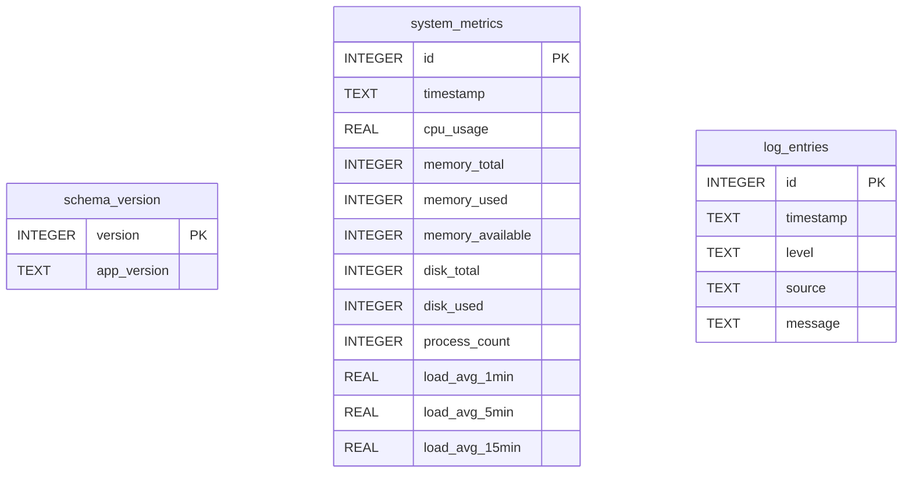

# systers

A system analysis and monitoring tool for Linux hosts that collects system metrics and log data, then generates comprehensive summary reports to help identify issues and guide maintenance tasks.

## Architecture

Systers consists of two complementary utilities that work together:

1. **syswriter** - A data collector that gathers system metrics and log information, storing them in a SQLite database
2. **sysreport** - A report generator that analyzes the collected data and produces formatted summaries


### Data Flow


## Features

- **System Metrics Collection**: CPU usage, memory usage, disk space, process counts, and load averages
- **Log Analysis**: Scans system logs for errors, warnings, and critical issues
- **Issue Detection**: Automatically identifies potential problems (high resource usage, critical errors)
- **Historical Analysis**: View trends and patterns over time
- **Actionable Recommendations**: Provides guidance on maintenance tasks

## Installation

### Prerequisites

- Rust 1.70 or later
- Linux operating system (tested on Ubuntu/Debian)

### Build from source

```bash
# Clone the repository
git clone https://github.com/johnzastrow/systers.git
cd systers

# Build the project
cargo build --release

# The binaries will be in target/release/
# Optionally, copy them to a directory in your PATH
sudo cp target/release/syswriter /usr/local/bin/
sudo cp target/release/sysreport /usr/local/bin/
```

## Usage

### Collecting Data with syswriter

Run `syswriter` to collect current system metrics and scan logs:

```bash
syswriter
```

By default, data is stored in `~/.systers.db`. You can override this with the `SYSTERS_DB_PATH` environment variable or `--db-path` flag:

```bash
# Using environment variable
SYSTERS_DB_PATH=/var/lib/systers/data.db syswriter

# Using command-line flag
syswriter --db-path /var/lib/systers/data.db
```

#### CLI Options

```bash
# View all options
syswriter --help

# Manual cleanup only (skip collection)
syswriter --cleanup

# Disable automatic cleanup after collection
syswriter --no-cleanup

# Custom retention period (default: 30 days)
syswriter --retention-days 60

# Enable enhanced system checks (requires external tools)
syswriter --system-checks

# Show available and missing external tools
syswriter --show-tools

# Check version
syswriter --version
```

#### Enhanced System Checks

Systers supports optional enhanced system checks that provide deeper insights into system health. These checks require external tools that may not be installed by default.

**Check which tools are available:**
```bash
syswriter --show-tools
```

This will show:
- ✓ Available tools you can use now
- ✗ Missing tools with installation instructions

**Run enhanced checks:**
```bash
# Basic collection (default)
syswriter

# With enhanced system checks
syswriter --system-checks
```

When you run `--system-checks`, you'll see:
- Which checks are actively running
- Results from each check
- Which checks could be enabled if you install missing tools
- Installation instructions for missing tools

**Example output:**
```
╔════════════════════════════════════════════════════════════════╗
║           ENHANCED SYSTEM CHECKS                               ║
╚════════════════════════════════════════════════════════════════╝

✓ Running: Package Update Check
  → 2 updates available (0 security) [apt]

✓ Running: Systemd Service Status
  → Total services: 189
  → Active services: 63
  → ⚠️  Failed services: 1
     - logrotate.service

✓ Running: SMART Disk Health Check
  → No disks found or unable to access (may need sudo)

✓ Running: Top Directories by Size
  → 1. / - 234.56 GB
  → 2. /home - 89.12 GB

─────────────────────────────────────────────────────────────────
SUMMARY:
  Active Checks: 4
    ✓ Package Updates
    ✓ Systemd Services
    ✓ SMART Disk Health
    ✓ Directory Sizes

  Available Checks (not enabled - missing tools):
    ✗ Network Usage (requires: iftop)
      Install: sudo apt install iftop
```

**Enhanced checks include:**
- **Package Updates**: Checks for available system updates (apt/dnf)
- **Systemd Services**: Reports failed services and service status
- **SMART Disk Health**: Monitors disk health using smartctl (requires sudo)
- **Directory Sizes**: Identifies large directories

**External Tools:**
- `smartctl` - SMART disk health monitoring
  - Install: `sudo apt install smartmontools` (Debian/Ubuntu)
- `journalctl` - Systemd journal access (usually pre-installed)
- `apt` - Package management (Debian/Ubuntu)
- `dnf` - Package management (RHEL/Fedora)
- `du` - Directory size analysis (usually pre-installed)

**Note:** Enhanced checks are optional. Basic system monitoring works without any external tools.

#### Logging Configuration

Systers uses structured logging that can be configured via the `RUST_LOG` environment variable:

```bash
# Default: INFO level (shows collection progress)
syswriter

# Debug mode (shows detailed metrics)
RUST_LOG=debug syswriter

# Quiet mode (errors only)
RUST_LOG=error syswriter

# Specific module logging
RUST_LOG=systers::collector=debug syswriter
```

#### Custom Log Paths

You can specify custom log files to scan:

```bash
# Using command-line flag (comma-separated)
syswriter --log-paths /var/log/syslog,/var/log/myapp.log,/custom/path/app.log

# Using environment variable (colon-separated)
SYSTERS_LOG_PATHS=/var/log/syslog:/custom/app.log syswriter

# Combine with other options
syswriter --log-paths /var/log/myapp.log --retention-days 60
```

If no custom paths are specified, systers scans the default Linux log locations:
- `/var/log/syslog`
- `/var/log/messages`
- `/var/log/kern.log`
- `/var/log/auth.log`

#### Running on a Schedule

To collect data hourly as intended, add a cron job:

```bash
# Edit your crontab
crontab -e

# Add this line to run every hour
0 * * * * /usr/local/bin/syswriter >> /var/log/syswriter.log 2>&1
```

Or use systemd timers for more control:

```bash
# Create /etc/systemd/system/syswriter.service
[Unit]
Description=Systers Data Collector
After=network.target

[Service]
Type=oneshot
ExecStart=/usr/local/bin/syswriter
User=root
StandardOutput=journal
StandardError=journal

# Create /etc/systemd/system/syswriter.timer
[Unit]
Description=Run Systers Data Collector Hourly

[Timer]
OnCalendar=hourly
Persistent=true

[Install]
WantedBy=timers.target

# Enable and start the timer
sudo systemctl enable syswriter.timer
sudo systemctl start syswriter.timer
```

### Generating Reports with sysreport

Run `sysreport` to view analysis of collected data:

```bash
# View last 24 hours (default)
sysreport

# View last 48 hours
sysreport --hours 48

# View last week
sysreport --hours 168

# Use custom database location
sysreport --db-path /var/lib/systers/data.db

# Show help
sysreport --help

# Check version
sysreport --version
```

The report includes:
- CPU, memory, and disk usage statistics (average and peak)
- System load averages
- Process counts
- Log analysis (errors, warnings, critical issues)
- Detected issues with severity indicators
- Actionable recommendations

#### Exporting Reports

Reports can be exported to files in different formats for archiving, automation, or integration with other tools:

```bash
# Export to JSON format (machine-readable)
sysreport --format json --output report.json

# Export to text file
sysreport --format text --output report.txt

# Export JSON to stdout (pipe to other tools)
sysreport --format json | jq '.metrics.avg_cpu_usage'

# Export with custom time range
sysreport --hours 168 --format json --output weekly-report.json
```

**Supported Formats:**
- `text` - Human-readable text format (default)
- `json` - JSON format for automation and integration

**Use Cases:**
- Archive reports for historical analysis
- Integrate with monitoring dashboards
- Process data with custom scripts
- Email reports as attachments
- Feed data into analytics platforms

### Example Output

```
╔════════════════════════════════════════════════════════════════╗
║              SYSTERS - SYSTEM ANALYSIS REPORT                  ║
╚════════════════════════════════════════════════════════════════╝

Report Period: 2025-11-04 21:47:25 UTC to 2025-11-05 21:47:25 UTC

━━━━━━━━━━━━━━━━━━━━━━━━━━━━━━━━━━━━━━━━━━━━━━━━━━━━━━━━━━━━━━━━
  SYSTEM METRICS
━━━━━━━━━━━━━━━━━━━━━━━━━━━━━━━━━━━━━━━━━━━━━━━━━━━━━━━━━━━━━━━━

CPU Usage:
  Average: 7.9%
  Peak:    7.9%

Memory Usage:
  Average: 9.1%
  Peak:    9.1%

...
```

## Database Schema

The SQLite database contains three tables:

- **schema_version**: Tracks database schema version and application version
- **system_metrics**: Stores system metrics with timestamps
- **log_entries**: Stores notable log entries (errors, warnings, critical issues)



## Configuration

Systers can be configured using YAML configuration files for persistent settings, or via environment variables and command-line flags for one-time overrides.

### Configuration File

Systers looks for configuration files in these locations (in order):
1. `./systers.yaml` (current directory)
2. `~/.config/systers/config.yaml` (user config)
3. `/etc/systers/config.yaml` (system config)
4. Built-in defaults (if no config file is found)

To generate a default configuration file:

```bash
# Generate config in current directory
syswriter --generate-config systers.yaml

# Generate config in user config directory
mkdir -p ~/.config/systers
syswriter --generate-config ~/.config/systers/config.yaml

# Generate config for system-wide use
sudo mkdir -p /etc/systers
sudo syswriter --generate-config /etc/systers/config.yaml
```

See `config.example.yaml` for a fully documented configuration template with examples for:
- Debian/Ubuntu systems (default)
- RHEL/CentOS/Fedora systems
- Custom application monitoring
- High-sensitivity monitoring
- Production server configurations

### Configuration Options

The YAML configuration file includes:

**Database Settings:**
- Database file path

**Thresholds:**
- CPU warning threshold (percentage)
- Memory warning threshold (percentage)
- Disk warning threshold (percentage)
- Load average warning threshold
- Error count threshold for recommendations

**Collection Settings:**
- Log file paths to scan
- Maximum log lines per file
- CPU measurement delay

**Display Settings:**
- Maximum recent errors to show in reports

**Retention:**
- Data retention period (days)

### Environment Variables

Environment variables override configuration file settings:

- `SYSTERS_DB_PATH`: Override the database location
- `SYSTERS_LOG_PATHS`: Override log file paths (colon-separated)
- `HOME`: Used to determine default database location
- `RUST_LOG`: Configure logging level (error, warn, info, debug)

### Default Log Files Scanned

For Debian/Ubuntu systems (default):
- `/var/log/syslog`
- `/var/log/messages`
- `/var/log/kern.log`
- `/var/log/auth.log`

For RHEL/CentOS/Fedora systems, edit the configuration file to use:
- `/var/log/messages`
- `/var/log/secure`
- `/var/log/cron`
- `/var/log/maillog`

## Permissions

- **syswriter** may need root privileges to read system log files
- Consider running as a dedicated user with read access to log files

## Development

```bash
# Run tests
cargo test

# Run clippy for linting
cargo clippy

# Format code
cargo fmt

# Run directly during development
cargo run --bin syswriter
cargo run --bin sysreport -- --hours 12
```

## Documentation

Additional documentation is available in the `docs/` directory:

- [TODO.md](docs/TODO.md) - Planned improvements and enhancements
- [CHANGELOG.md](docs/CHANGELOG.md) - Version history and changes
- [REQUIREMENTS.md](docs/REQUIREMENTS.md) - Detailed project requirements
- [CLAUDE.md](CLAUDE.md) - Developer guidance for Claude Code

## License

See LICENSE file for details.

## Contributing

Contributions are welcome! Please feel free to submit issues or pull requests.
